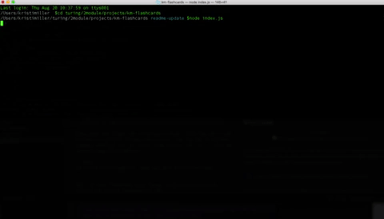

# FlashCards Solo Project

### Developer
- [Kristi Miller](https://github.com/Kristiannmiller)

### Instructors
- [Bob Gu](https://github.com/BobGu)
- [Travis Rollins](https://github.com/Kalikoze)


## Abstract

FlashCards is a program that simulates a set of flashcards through the command line.

## Showcase

<p align="center">Functionality</br>
  

## Setup

Clone down this repo (from GitHub).

Once you have cloned the repo, change into the directory and install the library dependencies. In the terminal, run:

```bash
node index.js
```

From there, you will be prompted for each question, have the opportunity to select an answer, and will be given feedback. You will be able to play through the entire deck of 30 cards, and will be shown a percentage correct after the 30th card has been answered.
